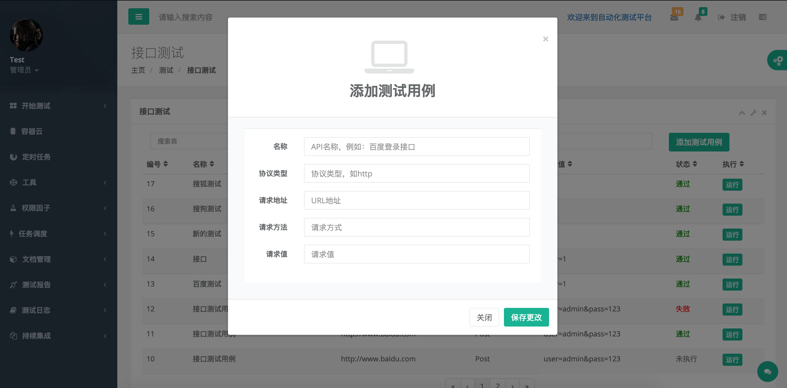
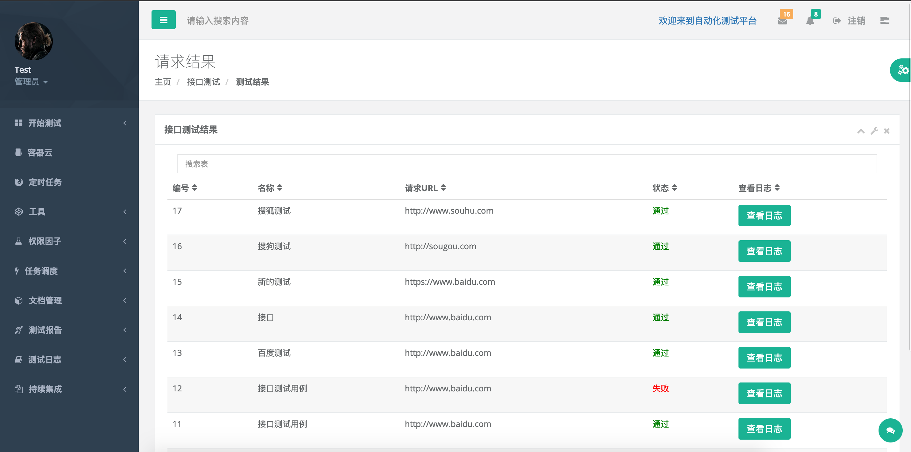
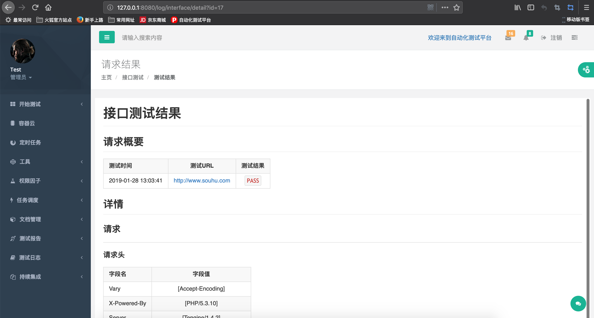
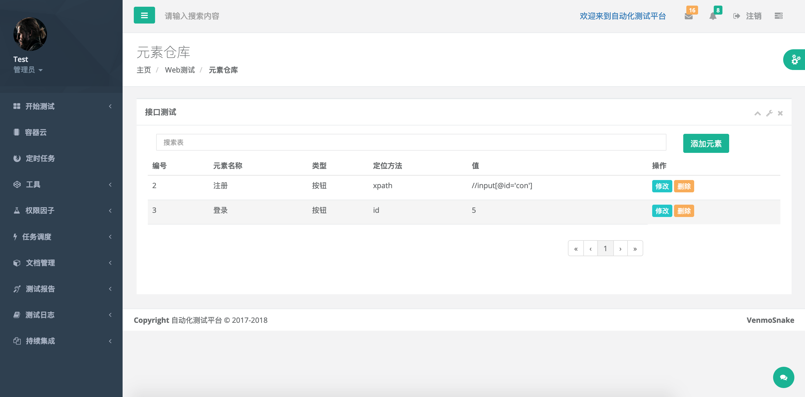
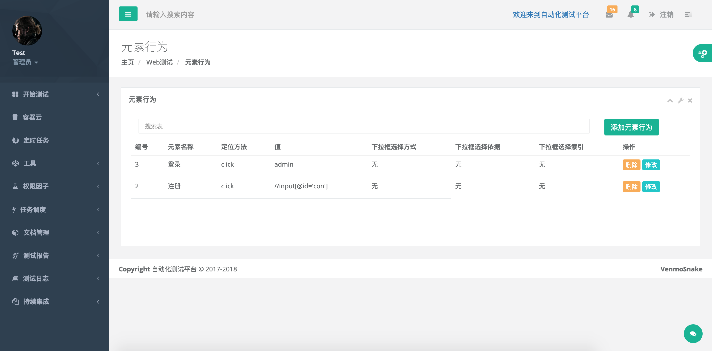
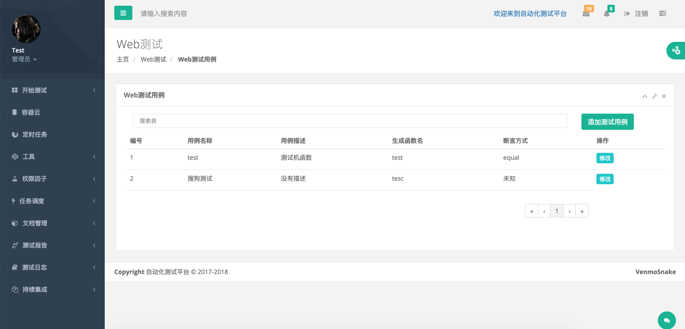
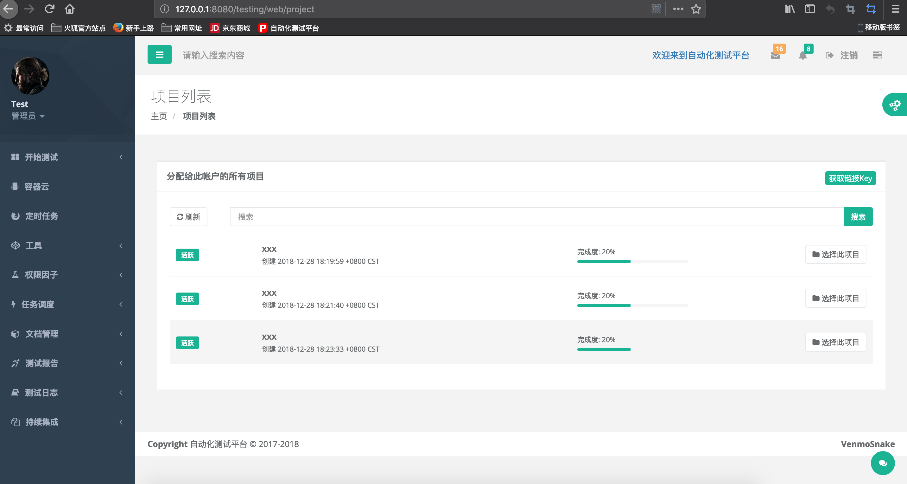
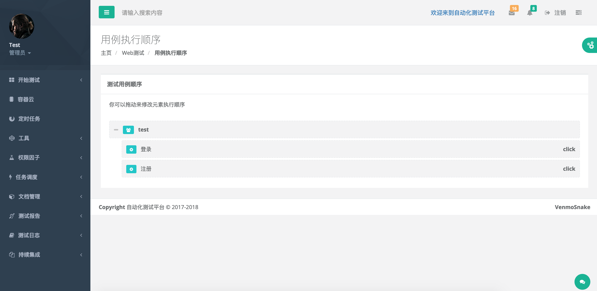
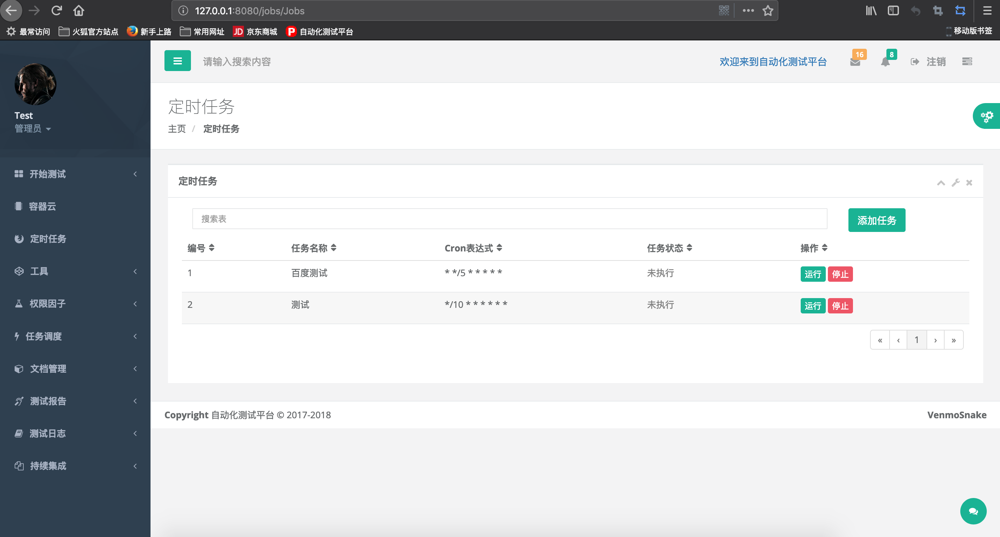

# 自动化测试平台
ATP可以完成接口测试，性能测试，web自动化测试(暂时没有渗透测试内容)，支持corn定时任务

## 平台介绍
平台采用go语言开发，框架使用beego，selenium客户端使用java编写，AI助手使用python编写（模型需要训练）

## 接口测试
接口测试暂时只支持HTTP协议

### 添加测试用例
添加测试用例后可直接执行测试

执行测试后可在测试日志-》接口测试日志中查询到该结果

## Web测试
Web测试基于selenium，同时维护一个元素仓库，将用的用到的元素验证统一管理，根据需要可以指定元素的行为，例如按钮的点击，输入框的输入等，根据流程可以自定义每个元素执行流程，测试框架采用TestNg，使用javassist动态生成测试类进行测试，并且测试后生成测试报告

### 元素仓库
将所有的元素集中在元素仓库中管理，使用时选择即可

### 元素行为
选择元素后可以为元素添加行为，例如按钮元素的行为是点击，输入框的行为是输入字符，（元素行为中输入行为暂不可用，Selenium中的sendkeys方法中参数为CharSequence，使用动态代理后字符串默认是String，会提示找不到sendkeys(String)方法）

### 测试用例
测试用例中有一个生成函数名，就是TestNg的@Test注解标柱的方法名，使用的断言方式（TestNg中的断言方式，待完善）

### 开始测试
开始测试时指定要测试的项目，修改每个元素的执行顺序

## 定时任务
本平台支持定时任务，使用corn表示定时测试

## 工具
平台支持，Markdown文档编辑，在线代码编辑以及执行，项目文件管理，在线PDF查看器

## 任务调度
功能开发中。。。

## 使用技术
感谢很多开源框架以及插件的作者
### 开发语言
+ java：selenium客户端
+ go：平台开发，性能测试，定时任务，任务调度，
+ python：使用Sec2Sec模型和attention机制制作的智能助手（需要进行训练）

### 前端
前端采取INSPINIA 2.7.1模板制作，以及相关js插件

## 联系我
邮箱：VenmoSnake@yeah.net

这个平台是工作之余时间制作，欢迎大家提供改进建议以及idea

